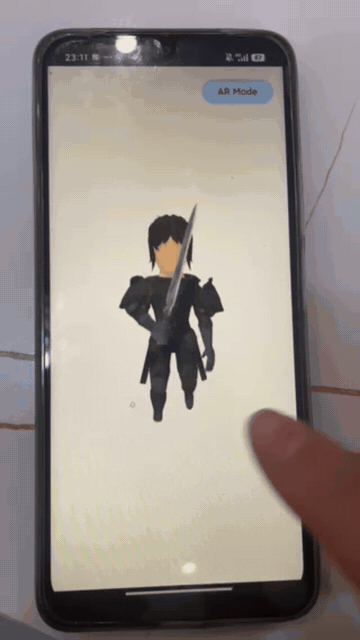
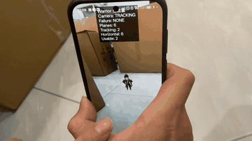
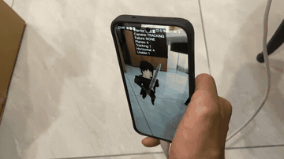

# Filament Animation Demo

一个使用 Kotlin、Jetpack Compose 与 Google Filament 实现的 Android 3D 动画技术作业。

应用加载 Warrior GLB 角色，循环播放“Walk → Sword Attack → Walk”动画，并通过 crossfade 平滑过渡。Bonus 部分使用 ARCore 检测现实环境中的水平面，用户点击平面后可将角色放置到对应 Anchor 上。

## Demo

点击预览图可直接打开对应 MP4；clone 仓库后也可在 `docs/demos/` 中获取全部演示视频。

### Demo 0 — Filament 动画与触摸控制

[](docs/demos/demo0.mp4)

[下载 demo0.mp4](docs/demos/demo0.mp4)

### Demo 1 — AR 平面检测与角色放置

[](docs/demos/demo1.mp4)

[下载 demo1.mp4](docs/demos/demo1.mp4)

### Demo 2 — AR 中的 Warrior 动画

[](docs/demos/demo2.mp4)

[下载 demo2.mp4](docs/demos/demo2.mp4)

## 已实现功能

- 使用 Filament `gltfio` 加载并渲染 `warrior.glb`
- Walk 播放约 3 秒后切换到完整的 Sword Attack，再返回 Walk
- Walk 与 Attack 之间进行 crossfade
- 根据模型 bounding box 自动调整普通 Viewer 的取景
- 支持普通 Viewer 的触摸旋转与缩放
- 普通 3D Viewer 与 AR 模式相互独立
- ARCore 摄像头画面与水平面检测
- 点击有效平面创建 Anchor，再次点击可重新放置角色
- AR 模式复用相同的动画状态机和 GLB 资源
- AR 不可用时安全返回普通 Viewer
- Camera、Tracking Failure 和 Plane 数量诊断信息

## 技术栈

- Kotlin / Jetpack Compose
- Google Filament 1.75.1
- ARCore 1.56.0
- GLB / glTF 2.0
- Gradle Kotlin DSL

## AI Coding Prompt 概览

以下内容是本项目从 0 到 1 开发过程中提交给 AI Coding Agent 的 Prompt 概括。为便于作业评审，保留每个阶段的目标、约束和验证要求，省略重复上下文与具体调试对话。

### 0. 项目目标
> 我先给你输入我现在的项目目标，然后你给我返回一个可行性方案的思路以及框架和每一步大体步骤，不需要现在开始写代码。
“在一个安卓的场景里面,用 Filament 实现让人物：走动并且挥剑的动画。
Bonus ：做成一个 AR 的效果。“

### 1. 检查项目并搭建最小 Filament 场景

> 用Android项目结构、Kotlin和Android SDK配置，选择兼容的Filament依赖。设计一个简单的GLB模型渲染架构，来实现最小可运行的Filament，并验证。

### 2. 寻找并准备人物模型

> 寻找公开可靠、许可证允许的人物 GLB/glTF 模型。角色需要持剑，并且至少包含”走路“和”挥剑“动画。说明模型来源、License、Filament兼容性及是否需要转换；确认前不要删除已有测试模型。

最终采用 Quaternius LowPoly RPG Characters 中的 Warrior，并保留 `fox.glb` 作为备用资源。

### 3. 加载 Warrior 并验证 Walk

> 将模型切换为 `warrior.glb`，列出所有 animation clip 的名称和 index。通过名称查找 Walk然后来循环播放 Walk，并根据bbox自动取景，保持触摸控制不变。

### 4. 实现 Walk 与 Sword Attack 状态机

> 使用明确的走路和挥剑状态。启动后先播放Walk约3秒，再从头完整播放一次Sword Attack，然后返回Walk并循环。记录状态并在状态切换时输出日志。

### 5. 添加动画 Crossfade

> 给Walk和Sword Attack的切换里加入短时间的crossfade，让动作衔接更自然。不要改变现状状态机行为

### 6. 修复普通 Viewer 的画面问题

> 将背景改为白色；确保每帧正确清理颜色缓冲，消除历史帧残影；改善角色照明，使人物从正面、侧面和背面观察时都能看到盔甲与剑的细节。优先增加环境光/间接光。

### 7. 设计并实现独立 AR Bonus

> 保留已经完成的普通 Filament Viewer，在独立AR 模式中创建anchor，并把warrior放置到anchor世界坐标。点击平面来放置。复用现有GLB和动画。


### 8. 增加 AR Plane 诊断信息

> 增加诊断记录：Camera trackingState、trackingFailureReason、Plane总数、TRACKING数量、水平向上数量和可用水平面数量。

### 9. 真机定位 Plane Detection 较慢的问题

> 安装 Debug APK 到真实设备并通过 adb logcat 观察 Camera 和 Plane 状态变化。不要放宽错误的 HitTest 条件；如果应用过滤没有问题，明确区分 ARCore 环境识别瓶颈与代码问题。根据证据做最小优化，并保留真实 Plane Anchor 放置要求。

根据真机日志，在保持 `PlaneFindingMode.HORIZONTAL` 的同时启用 `FocusMode.AUTO`，改善视觉特征获取。

### 10. 修复 Anchor 创建后模型不可见

> 修复导致已放置模型不可见的明确问题。


## 构建与运行

```bash
./gradlew :app:assembleDebug
```

普通 Viewer 可在 Android Emulator 或实体设备运行。AR Mode 需要支持 ARCore 的 Android 实体设备、Google Play Services for AR 和相机权限。

## 模型资源

Warrior 模型来源与授权信息见：

- `app/src/main/assets/models/ATTRIBUTION.md`
- `app/src/main/assets/models/WARRIOR_LICENSE.txt`
